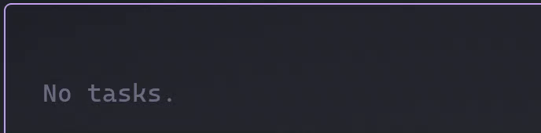
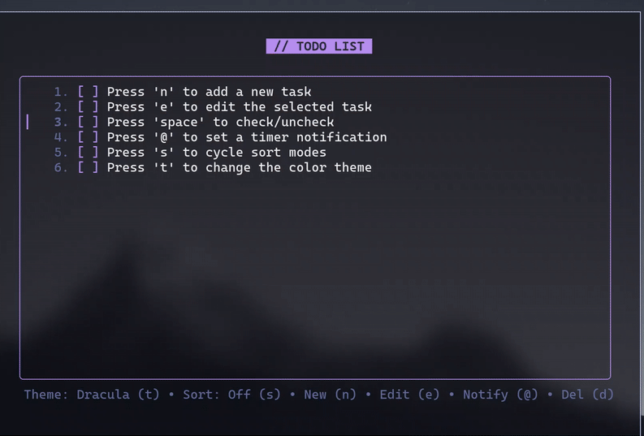
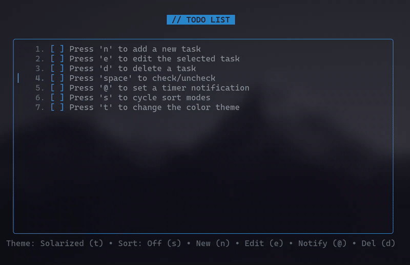
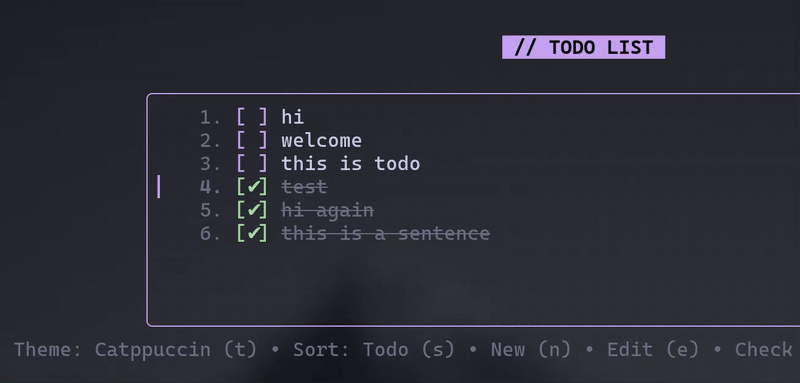
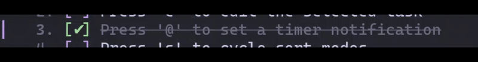

# Todo TUI

A simple, interactive, keyboard-driven TUI todo list manager for the terminal.


## Features

- Clean, colorful terminal interface with 10 built-in color themes
- 30 unique completion animations
- Timer notifications with desktop alerts (Windows, macOS, Linux)
- Flexible Inline editing and sorting modes (Off, Todo First, Done First)
- Persistent storage using JSON format
- Smooth animations for task completion and deletion

## Installation

### Go Install

If you have Go installed, you can install it directly:

```bash
go install github.com/nirabyte/todo@latest
```

OR get the binary directly [Todo](https://github.com/nirabyte/todo/raw/refs/heads/main/todo)

### Build from Source

Clone the repository and build the binary:

```bash
git clone https://github.com/nirabyte/todo.git
cd todo
go build -o todo todo.go
```

Move the binary to a location in your PATH for global access, or run it directly from the build directory.

## Usage

Start the application by running:

```bash
todo
```

The application launches with an interactive terminal interface. On first run, you'll see helpful hints to get started.

## Controls

### Navigation

| Key       | Action           |
| --------- | ---------------- |
| `↑` / `k` | Move cursor up   |
| `↓` / `j` | Move cursor down |
| `q`       | Quit application |
| `Ctrl+C`  | Quit application |

### Task Management

| Key     | Action                                 |
| ------- | -------------------------------------- |
| `n`     | Create a new task                      |
| `e`     | Edit the selected task                 |
| `d`     | Delete the selected task               |
| `Space` | Toggle task completion (check/uncheck) |
| `Enter` | Confirm input when editing or creating |
| `Esc`   | Cancel editing or creating             |



### Timer and Notifications

| Key | Action                                         |
| --- | ---------------------------------------------- |
| `@` | Set a timer notification for the selected task |

When setting a timer, enter a duration using Go's time duration format. Examples:

- `10m` - 10 minutes
- `1h30m` - 1 hour 30 minutes
- `45s` - 45 seconds
- `2h15m30s` - 2 hours 15 minutes 30 seconds

When a timer expires, you'll receive a desktop notification for the task. The timer countdown is displayed next to the task until it expires or the task is marked as complete.



### Customization

| Key | Action                         |
| --- | ------------------------------ |
| `t` | Cycle through available themes |
| `s` | Cycle through sorting modes    |

## Themes

Todo CLI includes 10 carefully curated color themes:

1. **Catppuccin** - Soothing pastel theme
2. **Nord** - Arctic, north-bluish color palette
3. **Gruvbox** - Retro groove color scheme
4. **Dracula** - Dark theme for the code-editing hours
5. **Tokyo Night** - Clean, dark theme inspired by Tokyo
6. **Rose Pine** - All natural pine, faux fur and a bit of soho vibes
7. **Everforest** - Comfortable and pleasant color scheme
8. **One Dark** - Atom's One Dark syntax theme
9. **Solarized** - Precision colors for machines and people
10. **Kanagawa** - NeoVim dark colorscheme inspired by Katsushika Hokusai

Press `t` to cycle through themes. Your theme preference is saved automatically.



## Sorting Modes

Three sorting modes are available:

- **Off** - No sorting (default order based on task creation)
- **Todo First** - Incomplete tasks appear at the top
- **Done First** - Completed tasks appear at the top

Press `s` to cycle through sorting modes. Your preference is saved automatically.



## Completion Animations

When you mark a task as complete, one of 30 unique animations plays. These include:

- Sparkle effects
- Matrix-style character transitions
- Wipe animations (left/right)
- Rainbow color transitions
- Typewriter effects
- Binary digit animations
- And many more

Each completion animation is randomly selected, ensuring a unique visual experience for every completed task.



## Data Storage

Tasks are stored locally in a `todos.json` file in the same directory where you run the application. The file includes:

- All tasks with their titles, completion status, and due dates
- Your selected theme preference
- Your selected sort mode preference

The data persists between sessions, so your tasks will be available the next time you run the application. The JSON format makes it easy to backup, export, or modify your tasks if needed.

## Requirements

- Go 1.25.5 or later (for building from source)
- A terminal that supports ANSI color codes
- Desktop notification support (optional, for timer notifications)

## Built With

- **Go** - Programming language
- **Bubble Tea** - TUI Framework
- **Lip Gloss** - Styling library
- **Beeep** - Cross-platform desktop notifications
